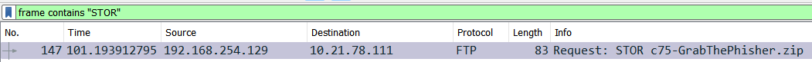
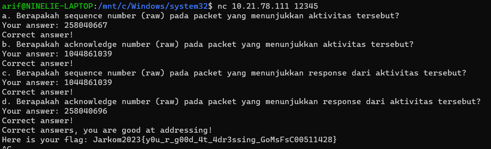
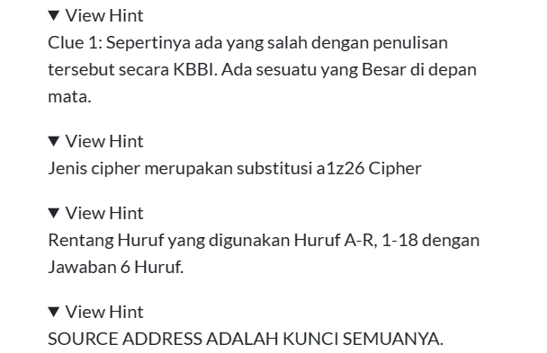
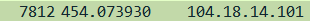
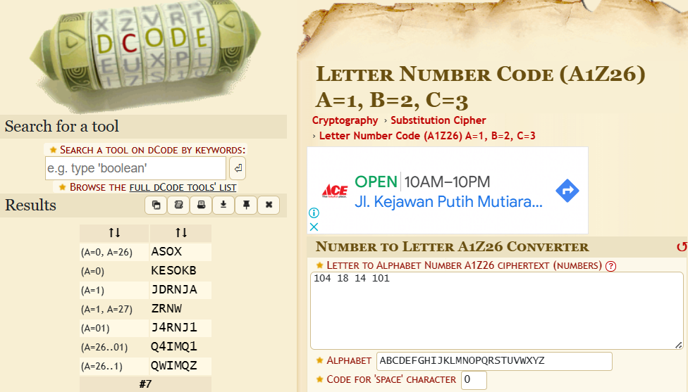
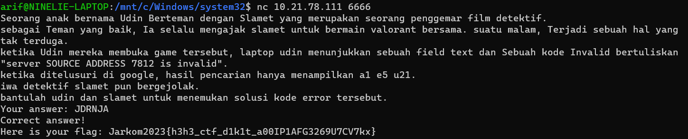
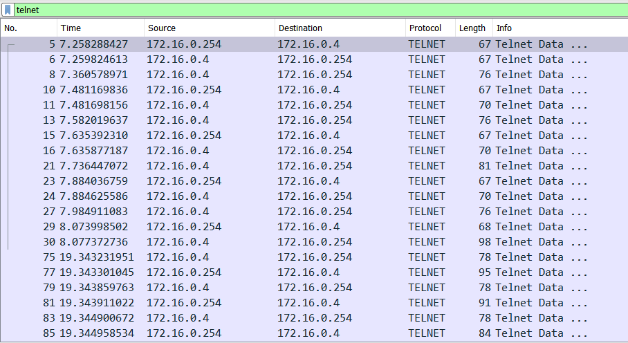
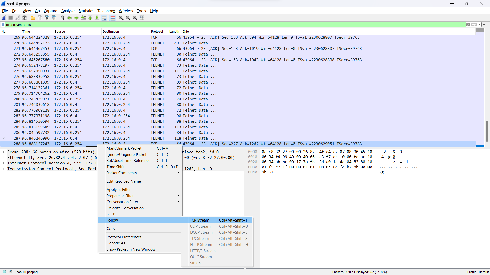
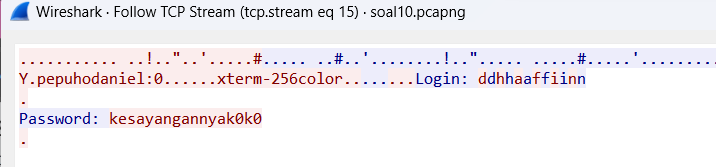
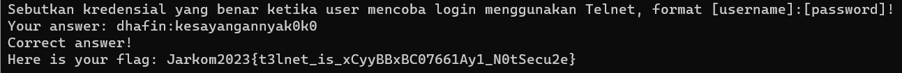

# Jarkom-Modul-1-D08-2023

Nama Anggota | NRP
------------------- | --------------		
Timothy Hosia Budianto | 5025211098
Arif Nugraha Santosa | 5025211048

## SOAL
1. User melakukan berbagai aktivitas dengan menggunakan protokol FTP. Salah satunya adalah mengunggah suatu file. <br>
  a.  Berapakah sequence number (raw) pada packet yang menunjukkan aktivitas tersebut? <br>
  b.  Berapakah acknowledge number (raw) pada packet yang menunjukkan aktivitas tersebut? <br>
  c.  Berapakah sequence number (raw) pada packet yang menunjukkan response dari aktivitas tersebut? <br>
  d.  Berapakah acknowledge number (raw) pada packet yang menunjukkan response dari aktivitas tersebut?

2. Sebutkan web server yang digunakan pada portal praktikum Jaringan Komputer!

3. Dapin sedang belajar analisis jaringan. Bantulah Dapin untuk mengerjakan soal berikut: <br>
  a. Berapa banyak paket yang tercapture dengan IP source maupun destination address adalah 239.255.255.250 dengan port 3702? <br>
  b. Protokol layer transport apa yang digunakan? <br>

4. Berapa nilai checksum yang didapat dari header pada paket nomor 130?

5. Elshe menemukan suatu file packet capture yang menarik. Bantulah Elshe untuk
menganalisis file packet capture tersebut. <br>
  a. Berapa banyak packet yang berhasil di capture dari file pcap tersebut?<br>
  b. Port berapakah pada server yang digunakan untuk service SMTP?<br>
  c. Dari semua alamat IP yang tercapture, IP berapakah yang merupakan public IP?<br>
  
**Soal 6-7 menggunakan file pcap yang sama.**

6. Seorang anak bernama Udin Berteman dengan SlameT yang merupakan seorang
penggemar film detektif. sebagai teman yang baik, Ia selalu mengajak slamet untuk
bermain valoranT bersama. suatu malam, terjadi sebuah hal yang tak terdUga. ketika
udin mereka membuka game tersebut, laptop udin menunjukkan sebuah field text dan
Sebuah kode Invalid bertuliskan "server SOURCE ADDRESS 7812 is invalid". ketika
ditelusuri di google, hasil pencarian hanya menampilkan a1 e5 u21. jiwa detektif slamet
pun bergejolak. bantulah udin dan slamet untuk menemukan solusi kode error tersebut.

7. Berapa jumlah packet yang menuju IP 184.87.193.88?

8. Berikan kueri filter sehingga wireshark hanya mengambil semua protokol paket yang
menuju port 80! (Jika terdapat lebih dari 1 port, maka urutkan sesuai dengan abjad)

9. Berikan kueri filter sehingga wireshark hanya mengambil paket yang berasal dari alamat
10.51.40.1 tetapi tidak menuju ke alamat 10.39.55.34!

10. Sebutkan kredensial yang benar ketika user mencoba login menggunakan Telnet

## Jawaban

### 1. Jawaban:
    a. Sequence number (raw) = 258040667
    b. Acknowledgment number (raw) = 1044861039
    c. Sequence number (raw) = 1044861039
    d. Acknowledgment number (raw) = 258040696

- #### Langkah:
  Pertama - tama, lakukan filtering agar mendapatkan frame yang menggunakan protokol `ftp` seperti gambar di bawah
  
  Atau menggunakan filter display: `frame contains "STOR"`
  
  Lalu cek bagian info yang menggunakan Request berupa `STOR` seperti pada gambar di atas (STOR merupakan request untuk mengunggah suatu file. Kemudian klik 2x pada tab tersebut).
  
  Untuk soal a dan b. Pilih TCP dan cek sequence number (raw) dan acknowledgement number (raw).
  Didapat `Sequence number (raw) = 258040667` dan `Acknowledgment number (raw) = 1044861039`.

  Kemudian untuk soal c dan d, kita harus mencari response dari request `STOR` tersebut. Frame yang menujukan response request `STOR` adalah frame setelah request tersebut yaitu frame nomor 149.
  
  Seperti yang kita lihat pada gambar di atas, `sequence number (raw)nya` mirip dengan acknowledgment number (raw) dari request yaitu `1044861039`. Dan `acknowledgement rumber (raw)` mirip dengan sequence number requestnya yaitu `258040696`.
   

- #### Kesulitan:
  Tidak ada

### 2. Jawaban: 
    gunicorn
- #### Langkah:
  Lakukan filter display : `frame contains “Jarkom”` <br> 
  Pilih IP yang  terfilter, lalu follow TCP Stream <br><br>
  
  ```
  HTTP/1.1 200 OK
  Server: gunicorn
  Date: Thu, 14 Sep 2023 12:52:59 GMT
  Connection: keep-alive
  Content-Type: text/html; charset=utf-8
  Content-Length: 7761
  Set-Cookie: session=1f6be1b9-b4e9-484f-b90b-ffca6f74fc72.vvasSxMXgw2D85_iBS4fJKREF5U; HttpOnly; Path=/; SameSite=Lax

  <!DOCTYPE html>
  <html>
  <head>
    <title>Praktikum Jarkom 2023</title>
  ```
- #### Kesulitan:
  Tidak ada.

### 3. Jawaban: 
    a. 21
    b. UDP
- #### Langkah:
  lakukan filter : `ip.addr == 239.255.255.250 and udp.port == 3702` <br> 
  Dapat kita lihat, ada 21 paket dan semuanya menggunakan protokol UDP <br>
  
- #### Kesulitan:
  Tidak ada.

### 4. Jawaban:
    0x18e5
- #### Langkah:
  Pertama kita lihat paket nomor `130`. <br>
  Lalu lihat **User Datagram Protocol**, kemudian lihat tabel **Checksum** <br>
  
- #### Kesulitan:
  Tidak ada.

### 5. Jawaban: 
    a. 60
    b. 25
    c. 74.53.140.153
- #### Langkah:
  a. Ada 60 packet yang terdeteksi <br>
  b. Port SMTP adalah 25 <br>
  c. Public IP, adalah IP diluar list berikut<br>
  ```
  10.0.0.0 — 10.255.255.255
  172.16.0.0 — 172.31.255.255
  192.168.0.0 — 192.168.255.255
  ```
  Untuk mengunlock file .txt untuk dapat yang berisi netcatnya, Follow salah satu data capture yang memiliki protocol SMTP, maka akan menghasilkan
  
    ```
  Hello
  I send u a p45sword of a zip file, but you should decode it in Base64.
  Here is the p45sword:
  NWltcGxlUGFzNXdvcmQ=
  ```
  Setelah kita decode passwordnya dengan base64, hasil passwordnya adalah
  `5implePas5word`
- #### Kesulitan:
  Mencari password file .txt

### 6. Jawaban:
    JDRNJA
- #### Langkah:
  Simplenya, soal ini meminta kita untuk mencari hasil string sebanyak 6 karakter sesuai dengan hint yang diberikan:
  
  
  Langkah pertama yang kita butuhkan adalah membuka file capture dan memilih frame nomor 7812. <br>
  

  Setelah mendapatkan framenya, sesuai dengan **HINT** terakhir yaitu `SOURCE ADDRESS ADALAH KUNCI SEMUANYA` kita akan melakukan decode pada source addressnya yaitu `104 18 14 101`. Untuk decode, kita akan menggunakan `cipher substitusi A1Z26`. Setelah kita decode, didapat jawaban di bawah.
  

  Kita sudah mendapatkan beberapa string dengan maksimal 6 digit. Kita lihat hint ke 3 `Rentang huruf yang digunakan Huruf A-R, 1-18 dengan jawaban 6 huruf`. Dari hint tersebut kita akan melihat jawaban dari string yang telah didecode. Setelah dicoba, hasil yang benar adalah string `JDRNJA`.
  

- #### Kesulitan:
  - Ketidakjelasan pada apa yang diminta pada soal, harus membuka hint untuk menyelesaikannya.
  - Kesulitan menentukan cipher yang digunakan dan apa yang harus didecode

### 7. Jawaban:
    6
- #### Langkah:
  Soal ini dapat diselesaikan dengan menggunakan query `ip.dst == 184.87.193.88`. Setelah itu kita hitung jumlah paketnya, hasilnya ada 6 paket.
  
- #### Kesulitan:
  Tidak ada.

### 8. Jawaban: 
    tcp.dstport == 80 || udp.dstport == 80
- #### Langkah:
  Menggunakan query `tcp.dstport == 80 || udp.dstport == 80`
  
- #### Kesulitan:
  Tidak ada.

### 9. Jawaban:
    ip.src == 10.51.40.1 && ip.dst != 10.39.55.34
- #### Langkah:
  Menggunakan query `ip.src == 10.51.40.1 && ip.dst != 10.39.55.34`<br>
  **Tidak menggunakan gambar karena IP tersebut tidak ada dalam paket yang diberikan**
- #### Kesulitan:
  Tidak ada.

### 10. Jawaban:
    dhafin:kesayangannyak0k0
- #### Langkah:
  Soal ini meminta kita untuk mencari kredensial yang benar ketika user mencoba login menggunakan Telnet. Pertama-tama, kita gunakanan filter `telnet` untuk mencari frame yang menggunakan protokol `telnet`.
  

  Kemudian kita akan menuju frame terbawah, karena kami berasumsi apabila user sudah melakukan login atau terkoneksi, maka frame paling bawah seharusnya mengandung kredensial. Setelah kita berada di frame paling bawah, lakukan `Follow -> TCP Stream` seperti pada gambar di bawah
  

  Lalu apabila kita perhatikan kita akan mendapatkan kredensialnya seperti gambar di bawah:
  

  Setelah dicoba dimasukan ke nc, hasilnya tidak langsung benar, username tersebut memiliki char yang double. Sehingga kredensial yang benar adalah
  ```
  Username: dhafin
  Password: kesayangannyak0k0
  ```
  Hasilnya:
  
- #### Kesulitan:
  Tidak ada.
