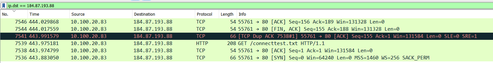

# Jarkom-Modul-1-D08-2023

Nama Anggota | NRP
------------------- | --------------		
Timothy Hosia Budianto | 5025211098
Arif Nugraha Santosa | 5025211048

## SOAL
1. User melakukan berbagai aktivitas dengan menggunakan protokol FTP. Salah satunya adalah mengunggah suatu file. <br>
  a.  Berapakah sequence number (raw) pada packet yang menunjukkan aktivitas tersebut? <br>
  b.  Berapakah acknowledge number (raw) pada packet yang menunjukkan aktivitas tersebut? <br>
  c.  Berapakah sequence number (raw) pada packet yang menunjukkan response dari aktivitas tersebut? <br>
  d.  Berapakah acknowledge number (raw) pada packet yang menunjukkan response dari aktivitas tersebut?

2. Sebutkan web server yang digunakan pada portal praktikum Jaringan Komputer!

3. Dapin sedang belajar analisis jaringan. Bantulah Dapin untuk mengerjakan soal berikut:
- a. Berapa banyak paket yang tercapture dengan IP source maupun destination
address adalah 239.255.255.250 dengan port 3702?
- b. Protokol layer transport apa yang digunakan?

4. Berapa nilai checksum yang didapat dari header pada paket nomor 130?

5. Elshe menemukan suatu file packet capture yang menarik. Bantulah Elshe untuk
menganalisis file packet capture tersebut.
- a. Berapa banyak packet yang berhasil di capture dari file pcap tersebut?
- b. Port berapakah pada server yang digunakan untuk service SMTP?
- c. Dari semua alamat IP yang tercapture, IP berapakah yang merupakan public IP?
Soal 6-7 menggunakan file pcap yang sama.

6. Seorang anak bernama Udin Berteman dengan SlameT yang merupakan seorang
penggemar film detektif. sebagai teman yang baik, Ia selalu mengajak slamet untuk
bermain valoranT bersama. suatu malam, terjadi sebuah hal yang tak terdUga. ketika
udin mereka membuka game tersebut, laptop udin menunjukkan sebuah field text dan
Sebuah kode Invalid bertuliskan "server SOURCE ADDRESS 7812 is invalid". ketika
ditelusuri di google, hasil pencarian hanya menampilkan a1 e5 u21. jiwa detektif slamet
pun bergejolak. bantulah udin dan slamet untuk menemukan solusi kode error tersebut.

7. Berapa jumlah packet yang menuju IP 184.87.193.88?

8. Berikan kueri filter sehingga wireshark hanya mengambil semua protokol paket yang
menuju port 80! (Jika terdapat lebih dari 1 port, maka urutkan sesuai dengan abjad)

9. Berikan kueri filter sehingga wireshark hanya mengambil paket yang berasal dari alamat
10.51.40.1 tetapi tidak menuju ke alamat 10.39.55.34!

10. Sebutkan kredensial yang benar ketika user mencoba login menggunakan Telnet

## Jawaban

1. Jawaban   :
<ol type="a">
  <li>Sequence number (raw) = 258040667</li>
  <li>Acknowledgment number (raw) = 1044861039</li>
  <li>Sequence number (raw) = 1044861039</li>
  <li>Acknowledgment number (raw) = 258040696</li>
</ol>

- Langkah   :
  Pertama - tama, lakukan filtering agar mendapatkan frame yang menggunakan protokol `ftp` seperti gambar di bawah
  

  Lalu cek bagian info yang menggunakan Request berupa `STOR` seperti pada gambar di atas (STOR merupakan request untuk mengunggah suatu file. Kemudian klik 2x pada tab tersebut).
  
  Untuk soal a dan b. Pilih TCP dan cek sequence number (raw) dan acknowledgement number (raw).
  Didapat `Sequence number (raw) = 258040667` dan `Acknowledgment number (raw) = 1044861039`.

  Kemudian untuk soal c dan d, kita harus mencari response dari request `STOR` tersebut. Frame yang menujukan response request `STOR` adalah frame setelah request tersebut yaitu frame nomor 149.
  
  Seperti yang kita lihat pada gambar di atas, `sequence number (raw)nya` mirip dengan acknowledgment number (raw) dari request yaitu `1044861039`. Dan `acknowledgement rumber (raw)` mirip dengan sequence number requestnya yaitu `258040696`.

- Kesulitan : Sempat bingung dalam mencari request STOR, apakah bisa menggunakan query filtering?

2. Jawaban   : gunicorn
- Langkah   : <br> 
filter display : frame contains “Jarkom” <br> 
Pilih ip yang ke filter, lalu follow tcp stream <br><br>

```
HTTP/1.1 200 OK
Server: gunicorn
Date: Thu, 14 Sep 2023 12:52:59 GMT
Connection: keep-alive
Content-Type: text/html; charset=utf-8
Content-Length: 7761
Set-Cookie: session=1f6be1b9-b4e9-484f-b90b-ffca6f74fc72.vvasSxMXgw2D85_iBS4fJKREF5U; HttpOnly; Path=/; SameSite=Lax

<!DOCTYPE html>
<html>
<head>
  <title>Praktikum Jarkom 2023</title>
```
- Kesulitan : -

3. Jawaban   : A. 21 | B.UDP <br> 
- Langkah   :  <br> 
Filter : ip.addr == 239.255.255.250 and udp.port == 3702 <br> 
Bisa dilihat ada 21 hasil dan semuanya protokol UDP <br><br>

- Kesulitan : -

4. Jawaban   : 0x18e5 <br> 
- Langkah   : <br> 
Lihat paket nomor 130 <br>
Liat user datagram protocol, kemudian lihat tabel checksum <br><br>

- Kesulitan : -

5. Jawaban   : A. 60 | B. 25 | C. 74.53.140.153 <br>
- Langkah   : <br>
A. Ada 60 packet yang ada <br>
B. Port smtp adalah 25 <br>
C. Yang public ip, adalah ip diluar
```
10.0.0.0 — 10.255.255.255
172.16.0.0 — 172.31.255.255
192.168.0.0 — 192.168.255.255
```
Untuk unlock file txt untuk dapat nc, Follow salah satu data capture yang memiliki protocol smtp, akan menghasilkan
```
Hello
I send u a p45sword of a zip file, but you should decode it in Base64.
Here is the p45sword:
NWltcGxlUGFzNXdvcmQ=
```

- Kesulitan : Mencari password file txt

6. Jawaban   :
- Langkah   :
- Kesulitan :

7. Jawaban   : 6
- Langkah   :
Hal ini dapat kita cek dengan menggunakan query ip.dst == 184.87.193.88. Setelah itu kita hitung dan hasilnya ada 6 paket. <br><br>

- Kesulitan : -

8. Jawaban   : tcp.dstport == 80 || udp.dstport == 80 <br>
- Langkah   : Menggunakan query <br><br>

- Kesulitan : -

9. Jawaban   : ip.src == 10.51.40.1 && ip.dst != 10.39.55.34 <br>
- Langkah   : Menggunakan query 
- Kesulitan : -

10. Jawaban   :
- Langkah   :
- Kesulitan :
